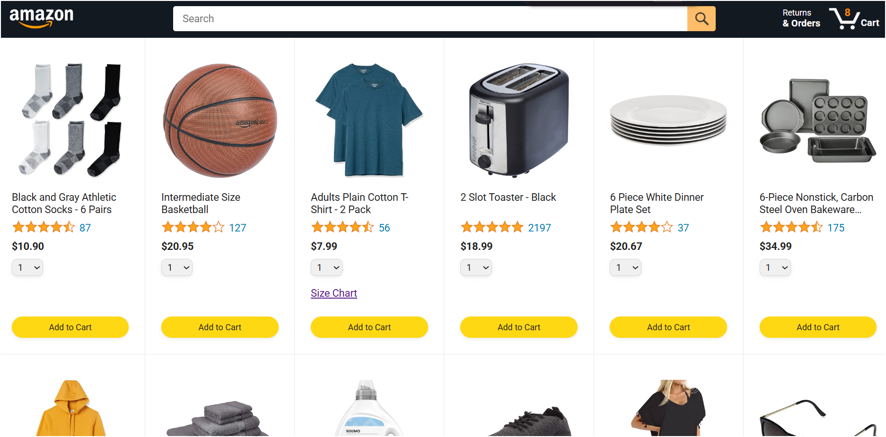
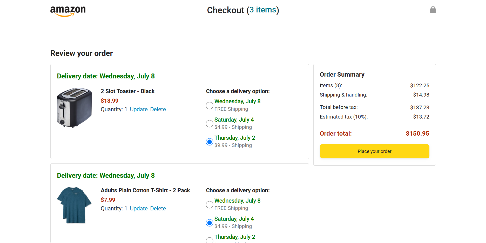

# Amazon JavaScript Project

This project is a front-end Amazon-style shopping cart built with JavaScript, HTML, and CSS.

## What I Practiced

- JavaScript modules using `import` and `export`
- Rendering product cards dynamically from data
- Adding products to the cart
- Saving cart data with `localStorage`
- Updating cart quantity after refresh
- Checkout page rendering
- Delivery options with selected radio buttons
- Saving selected delivery option IDs into the cart
- Payment summary calculations
- Object-oriented programming
- JavaScript classes and constructors
- Private fields
- Inheritance and polymorphism for different product types
- Promises, `fetch`, and `async` / `await`
- Error handling using `try...catch`

## Main Features

- Product listing page
- Add to cart behavior
- Persistent cart using browser storage
- Checkout order summary
- Delivery date updates
- Shipping price calculation
- Order total calculation
- Modular JavaScript file structure

## Technologies

- HTML
- CSS
- JavaScript
- Day.js
- Browser `localStorage`

## Notes

This project helped me move from procedural JavaScript into a more organized module-based and object-oriented style. It also gave me practice with real front-end concepts like DOM updates, events, data storage, and asynchronous JavaScript.

